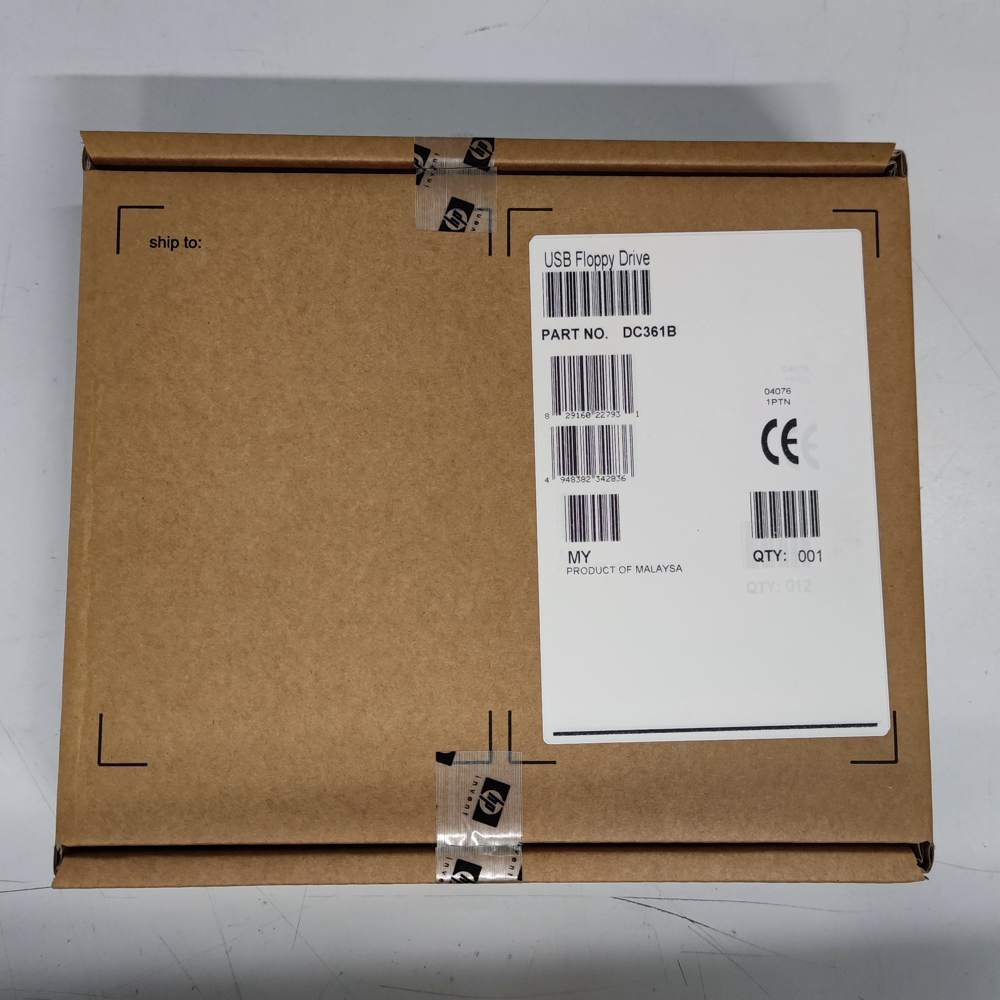

# Formattazioni speciali da effettuare con i Floppy USB

In questa pagina voglio spiegare come fomrattare i Floppy Disk da 3,5" a **720Kb** e **1,68Mb**;
Non tutti i Floppy Disk USB possono effettuare queste operazioni, per questa guida ho utilizzato un Floppy Disk USB marca HP.

*Questa è la scatola di cartone che contiene il Floppy Disk:*

*E questo è il floppy:*

*Ancora un paio di viste*:

Cosa troverete in questa guida:

- [Formattare a 720Kb](/720Kb_it.md) un Floppy utilizzando Windows o Linux (magari in seguito aggiornerò la pagina includendo MacOS)

- [Formattare a 1,86Mb](/168Mb_it.md) un Floppy utilzzando una chiavetta USB avviabile con FreeDOS

Thanks
