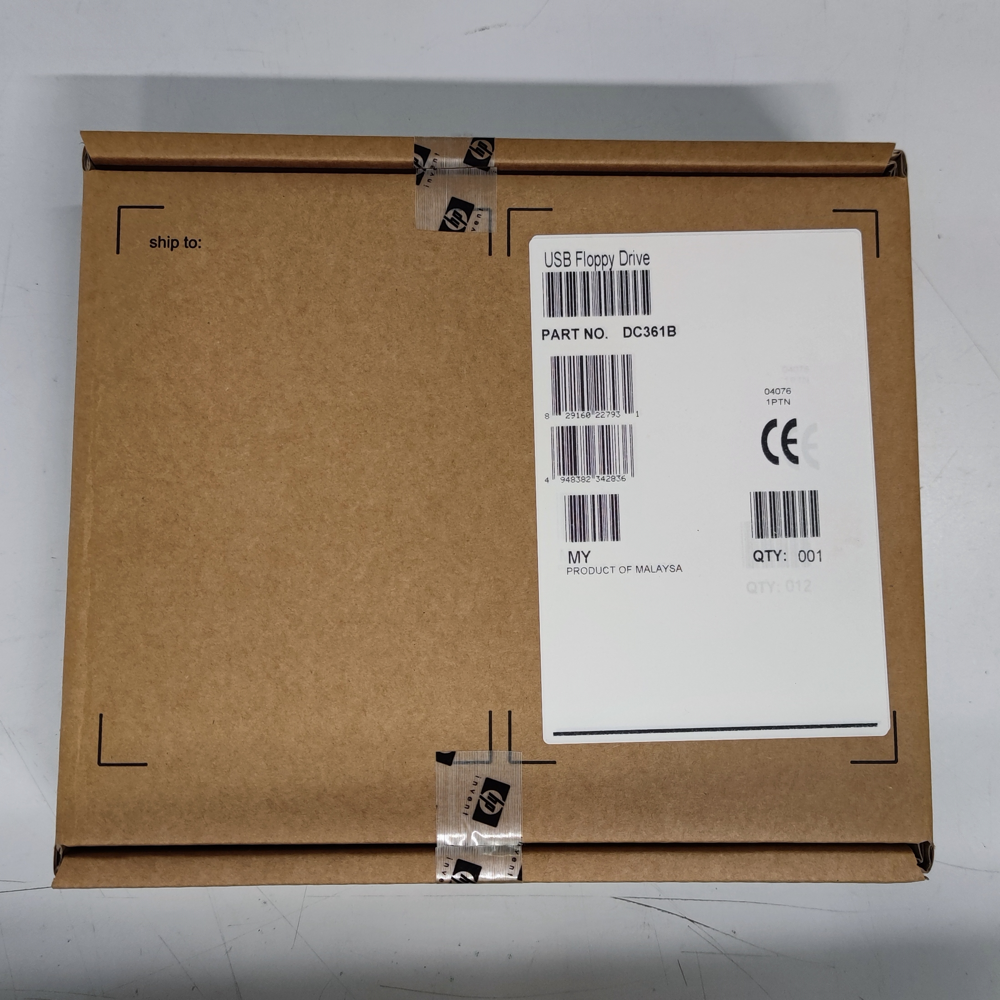
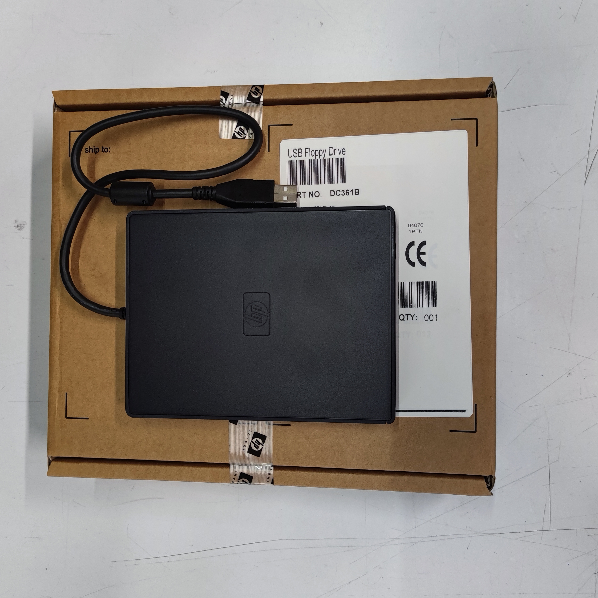
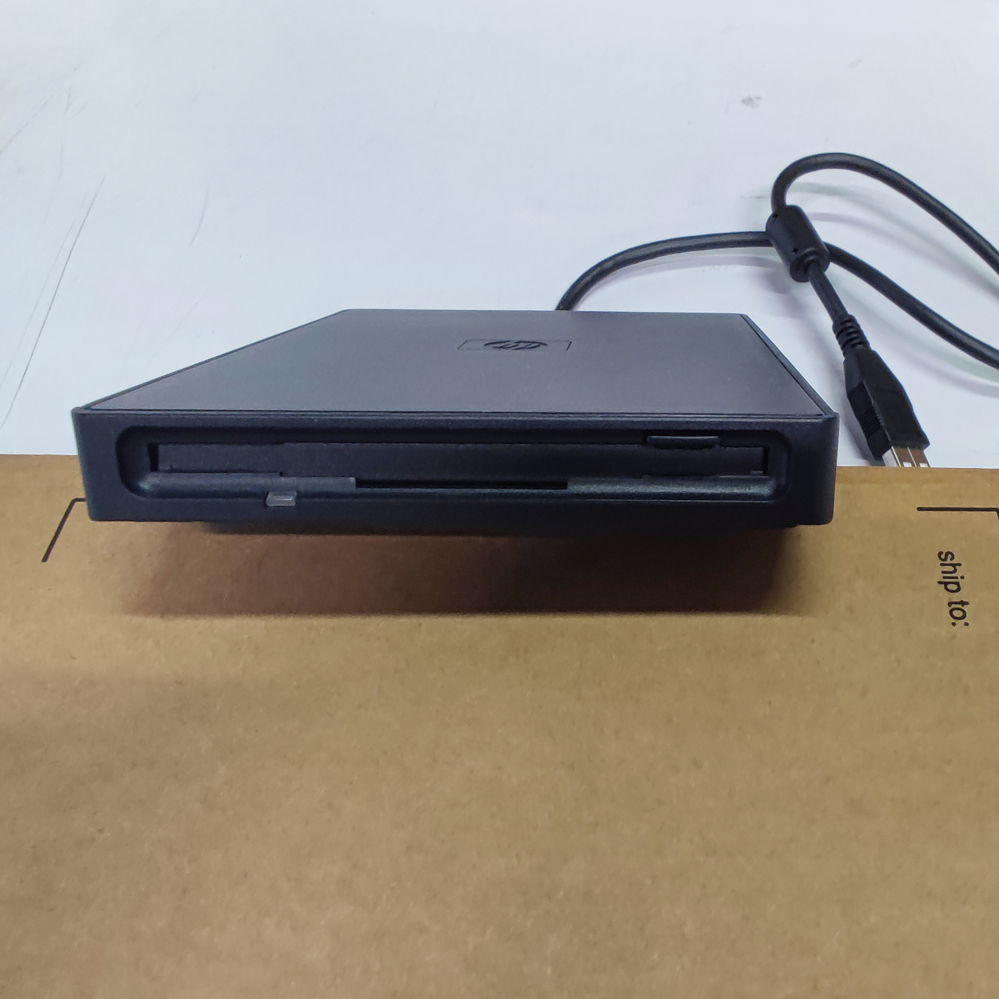
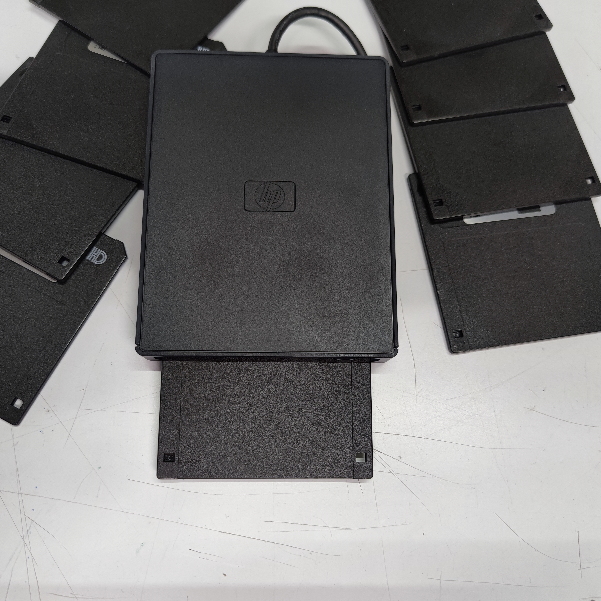

# Special Floppy formatting with USB Drive

# 🇮🇹 Se cerchi la guida in Italiano, [vai qui](/readme.md).

In this page I want to explain how format 3.5" Floppy drive at **720Kb** and **1.68Mb**;

To start, let's have a look at 3.5" floppies types that have been marketed.

### How to distinguish the capabilities of floppies at a glance

The following graphic representation shows you the three types of 3.5" floppy disks that are (was) on the market.

The ones shown are the standard capacities in the FAT16 format.
Operating systems different than MS-DOS may initialize disks with different capacities.

### Special formatting?

We will see in the various sections what is special about this type of formatting, but I must anticipate that not all USB Floppy Disks can perform these operations.

For this guide, I've used an HP Floppy Disk USB. Below are photos of this item.

*This is the carton box containing the floppy drive:*

*This the floppy drive:*

*Another couple of views:*

### My guide

Here are the guides I created:

- [Format 720Kb](/720Kb-en.md) Floppy from Windows and Linux (maybe I'll update for MacOS later)

- [Format 1.86Mb](/168Mb-ne.md) Floppy from a bootable FreeDOS live USB memory

- Guida in lingua [Italiana](/readme.md)

Thanks
