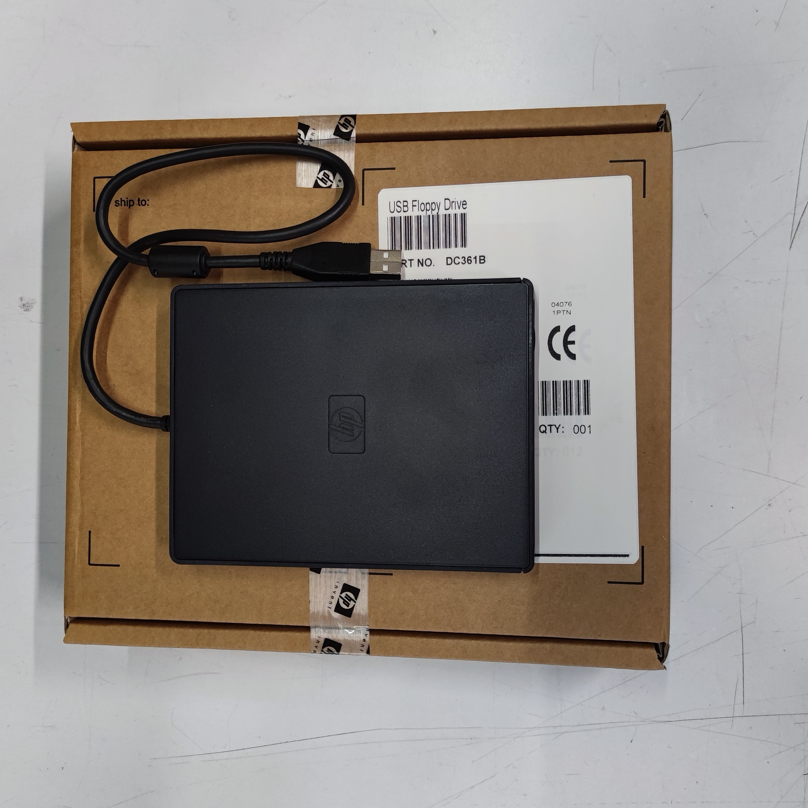
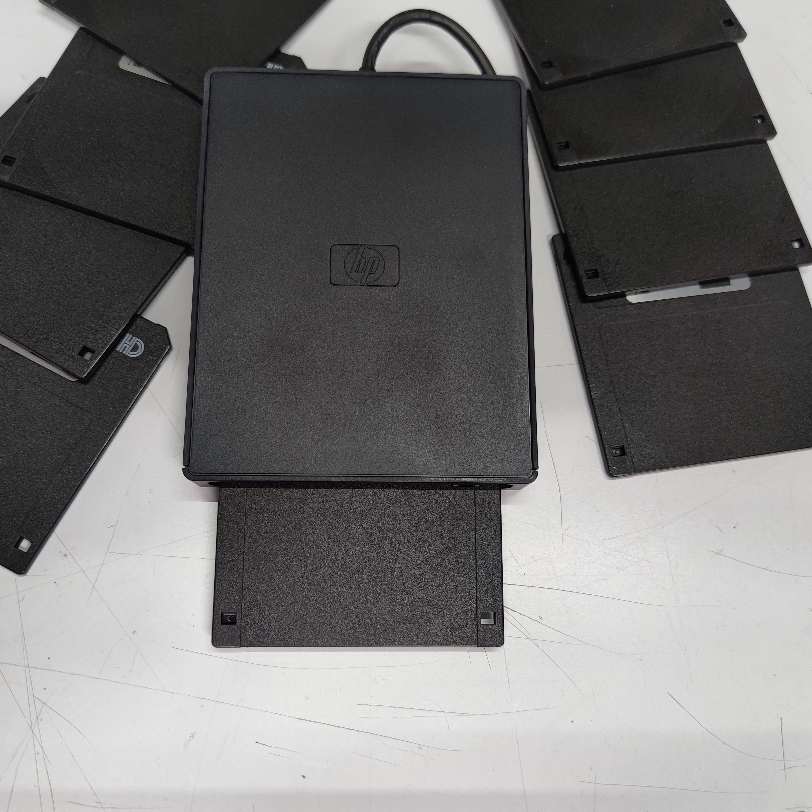

# Formattazioni speciali da effettuare con i Floppy USB

## 🇬🇧 If you are looking for English guide, [go here](/readme-en.md).

In questa pagina voglio spiegare come fomrattare i Floppy Disk da 3,5" a **720Kb** e **1,68Mb**;

Per iniziare, diamo un'occhiata alle tipologie di floppy da 3,5" che sono stati commercializati.

### Come distinguere ad occhio le capacità dei floppy
La seguente rappresentazione grafica, vi mostra le tre tipologie di floppy disk da 3,5" che si trovano (trovavano) in commercio.

Quelle raffigurate sono le capacità standard nel formato FAT16. Sistemi operativi differenti da MS-DOS potevano inizializzare i folppy con capacità differenti.

### Perchè formattazioni speciali?

Veadremo nelle varie sezioni cosa hanno di speciale questo tipo di formattazione, devo però anticipare che non tutti i Floppy Disk USB possono effettuare queste operazioni.

Per questa guida ho utilizzato un Floppy Disk USB marca HP di cui vi allego alcunbe foto.

*Questa è la scatola di cartone che contiene il Floppy Disk:*

*E questo è il floppy:*

*Ancora un paio di viste*:

### Le guide

Ecco le guide che ho realizato:

- [Formattare a 720Kb](/720Kb-it.md) un Floppy utilizzando Windows o Linux (magari in seguito aggiornerò la pagina includendo MacOS)

- [Formattare a 1,86Mb](/168Mb-it.md) un Floppy utilzzando una chiavetta USB avviabile con FreeDOS

- [English guide](/readme-en.md)

Thanks
